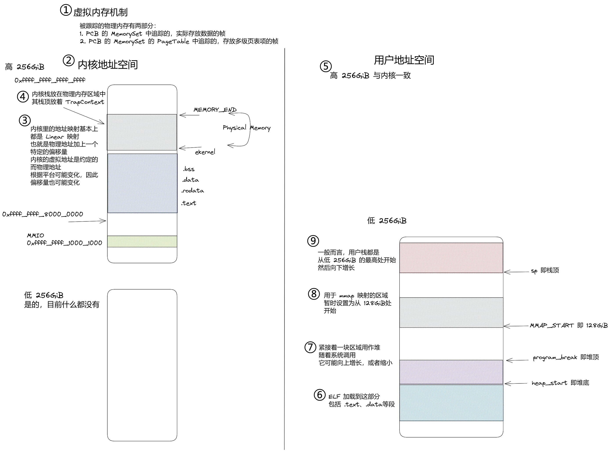

# Neuclear

基于 rCore，兼容 Linux，用 Rust 编写的操作系统。

名称化用自 Nuclear 即原子核，与内核 (kernel) 虽然在英文上没什么关联，但至少都带个核不是（）

由于开发人员都来自东北大学 (Neu)，因此化用为 Neuclear 作为队伍名称与系统名称

## 可以参考的资料

<https://gitee.com/LoanCold/ultraos_backup>

<https://github.com/equation314/nimbos>

<https://gitlab.eduxiji.net/dh2zz/oskernel2022>

<https://tooldiy.ry.rs/firmware/RustSBI/>

## 项目结构说明

### bintool

放一些调试用的工具，像是探查 elf 内容，打包 elf 之类的。

常常也会在此目录下进行二进制文件的反汇编等工作（通过 rust-objdump）

### deps

一些第三方库，可能会需要做出修改来适应本项目的需求

- rust-fatfs 库，做了点细微的修改

### kernel

内核部分，会编译得到内核的二进制文件

### res

参考资料；系统镜像；BootLoader 之类的。总之是一些相关的资源

由于 git 不适合存放二进制资源，其内容我会打包上传

### testsuits-for-oskernel

似乎是去年决赛的测试样例？

### user

rCore 的残留，不过也可以拿来做测试用，所以不急着删。

## 运行方式

根目录下 `make run`。

如希望带有日志，则设置环境变量 `LOG=DEBUG`。

## 系统说明

### 虚存机制

rCore 中的虚拟地址采取了双页表的方式，即内核和用户进程几乎完全隔离。它的好处在于提供了很高的安全性。然而在实践中，这导致了许多麻烦与一些模糊的难以解决的问题。

因此，本 OS 采取类似于 Linux 的方式，内核部分位于高 256GiB 的部分，而用户进程相关的部分则在低 256GiB 中。

内核的地址空间布局部分参考 Linux，见[文档](https://www.kernel.org/doc/html/latest/riscv/vm-layout.html)。

其中内核的 .text、.data 等段大约是在 0xffff_ffff_8000_0000 之后一些载入。

和 Linux 不同的是，目前物理内存的直接映射紧跟在内核之后，也就是 `ekernel` 之后。

为了支持这样的布局，OS 至少需要做出两个更改：

1. 链接脚本 (kernel/src/linker.ld) 需要修改，将基地址从 0x8020_0000 修改为 0xffff_ffff_8020_0000
2. 为了在 boot 时地址合法，需要有一个临时的页表，它将 0x8000_0000 和 0xffff_ffff_8000_0000 起始的一个 1GiB 的大页映射到 0x8000_0000，具体看 kernel/src/entry.asm 中的 __set_boot_pt 函数即可

注意，在 boot 时，qemu 会把操作系统装载到物理地址 0x8020_0000 开始，所以虽然链接脚本的基地址是 0xffff_ffff_8020_0000，实际执行时，最初的 pc 还是 0x8020_0000。而为了避免实际地址和链接地址的不一致，需要尽快映射一个临时的页表来将其统一。紧接着，在内核的初始化中，内核页表会重新建立。

建立完毕的内核地址空间采取线性映射，物理地址和虚拟地址之间有一个固定的偏移 (0xffff_ffff_0000_0000)，具体参看如下地址空间的图示。

每个新进程创建后，都需要将内核的部分映射到高地址，这个只要将根页面中的一些项指向内核的根页表中对应的项即可。

### 线程和进程

Linux 中的线程就是一种轻量级进程，这和 rCore 中是不太一样的——线程创建是通过 `clone()`/`fork()` 系统调用完成的。

从 musl 的 pthread 源码中确实可以发现是进行了 `clone()` 系统调用的。

暂时而言，我倾向于线程和进程作为不同的结构，即 TCB 和 PCB，而非 Linux 的轻量级进程方式。

具体而言，每个进程至少有一个主线程，还可以有多个额外的线程。线程会持有进程的弱引用。

目前还不知道能否保持这种语义，同时兼容于 Linux 的接口

#### 加载器

加载器加载 ELF 可执行文件时，`argc`、`argv`、参数、环境变量、`auxv`、如何排布是有具体要求的。

可以参考：

- <http://articles.manugarg.com/aboutelfauxiliaryvectors.html>
- <https://gitlab.eduxiji.net/scPointer/maturin/-/blob/master/kernel/src/loaders/init_info.rs#L27>
- <http://www.lenky.info/archives/2013/02/2203>

res/abi386-4.pdf 中的 Figure 3-31 也有比较粗略的描述。

`auxv` 即辅助向量，可以参考 <https://blog.csdn.net/choumin/article/details/111385498>

注意，辅助向量要尽早完成，因为 `PAGE_SIZE` 等是要参考它的。

> 如果遇到 mmap 时 len==0 的情况，可能是 auxv 没有处理的原因。
> 在 Linux 现行规范中，len==0 的情况是错误的

#### 信号机制

目前实现的信号机制是：

- 每个进程具有不同的动作，进程内的线程共享动作 (`SigHandlers`)
- 同一进程的每个线程可以有不同的信号掩码 (`SignalReceiver`)
- 信号的设置针对进程，但立刻被转发到合适的线程上（如果在该线程运行之前，其掩码又被设置为屏蔽该信号该如何？）

### 文件系统

目前仅支持 FAT32 文件系统，这是通过第三方依赖 (deps/rust-fatfs) 完成的。

这个依赖的坏处在于，内部使用的都是 `RefCell`，所以是非 `Sync` 的，无法支撑后续的多核运行。

目前先就这样，只处理单处理器的情况

## Todo List

- [ ] 页表机制要换。目前是 rCore 式的双页表，通过跳板进行 trap 处理。但实践下来感觉造成的问题更多，切成 linux 或者 windows 那样的最好。这个工作越早进行越好，因为影响面比较广。
- [ ] Cow 虚拟页
- [ ] 页面置换
- [ ] 信号机制。目前还没有具体的处理。
- [ ] 标记 `unsafe`。这里的阻碍是我不太敢对 `unsafe` 乱下手，可能还得花时间看死灵书
- [ ] 多核启动
- [ ] 需要探索的：如何做内核 profile、页表中的 ASID、D/A/G 位

## 注意事项

- rust-analyzer 在 riscv target 下可能有误报 can't find crate for `test`，解决它需要设置 `rust-analyzer.check.allTargets` 为 false
