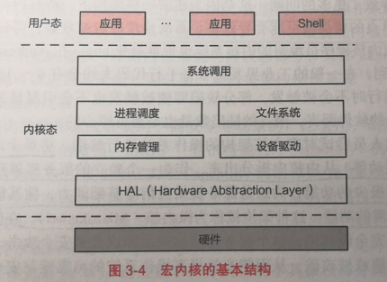
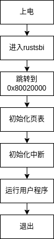
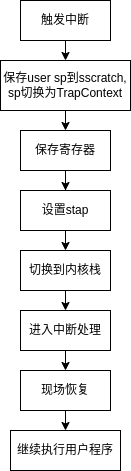

# 整体结构

## 基本架构

Neuclear 的基本结构为（图片来自`《现代操作系统: 设计与实现》`）

- 应用程序运行在 `U mode`, 通过 系统调用的接口与操作系统内核交互
- 内核运行在 `S mode`, 有着对内存管理和进程调度的权限，同时文件操作也有相应的系统调用
- `RustSBI` 运行在 `M mode` 为内核提供底层的支持

## 启动流程

1. 首先初始化临时页表
2. 然后跳转到高地址，紧接着初始化真正的页表
3. 初始化内核堆、帧分配器，开启中断等
4. 开始加载用户程序并运行

### Trap 处理

Trap 上下文位于内核栈的最高地址处，这仅仅是为了方便。

用户发生 trap 时，跳转到内核的 `__alltraps` 函数中，进行现场保护。

至于处理 trap 的真正逻辑在 `__trap_handler` 函数中，包括系统调用，页错误，定时器中断等。

完成处理后，在 `__restore` 函数中恢复上下文，并且回到用户态继续执行。

首先通过 `__alltraps` 将 `Trap` 上下文保存在内核栈上，然后跳转到`trap_handler` 函数完成`Trap`分发及处理
当`trap_handler`返回之后，使用`__restore`从保存在内核栈上的`Trap`上下文恢复寄存器
最后通过一条`sret`指令回到用户态执行应用程序

