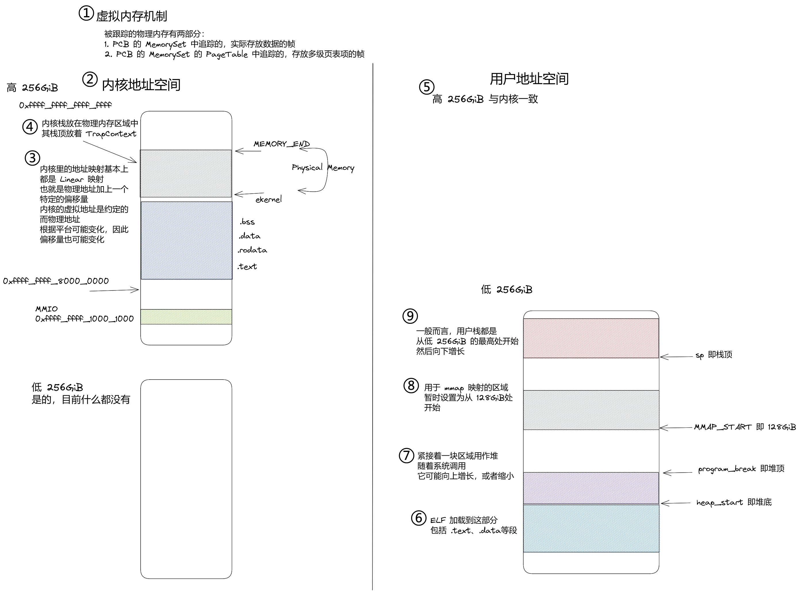

# 虚存机制

rCore 中的虚拟地址采取了双页表的方式，即内核和用户进程几乎完全隔离。它的好处在于提供了很高的安全性。然而在实践中，这导致了许多麻烦与一些模糊的难以解决的问题。

因此，本 OS 采取类似于 Linux 的方式，内核部分位于高 256GiB 的部分，而用户进程相关的部分则在低 256GiB 中。

内核的地址空间布局部分参考 Linux，见[文档](https://www.kernel.org/doc/html/latest/riscv/vm-layout.html)。

其中内核的 .text、.data 等段大约是在 0xffff_ffff_8000_0000 之后一些载入。

和 Linux 不同的是，目前物理内存的直接映射紧跟在内核之后，也就是 `ekernel` 之后。

为了支持这样的布局，OS 至少需要做出两个更改：

1. 链接脚本 (kernel/src/linker.ld) 需要修改，将基地址从 0x8020_0000 修改为 0xffff_ffff_8020_0000
2. 为了在 boot 时地址合法，需要有一个临时的页表，它将 0x8000_0000 和 0xffff_ffff_8000_0000 起始的一个 1GiB 的大页映射到 0x8000_0000，具体看 kernel/src/entry.asm 中的 __set_boot_pt 函数即可

注意，在 boot 时，qemu 会把操作系统装载到物理地址 0x8020_0000 开始，所以虽然链接脚本的基地址是 0xffff_ffff_8020_0000，实际执行时，最初的 pc 还是 0x8020_0000。而为了避免实际地址和链接地址的不一致，需要尽快映射一个临时的页表来将其统一。紧接着，在内核的初始化中，内核页表会重新建立。

建立完毕的内核地址空间采取线性映射，物理地址和虚拟地址之间有一个固定的偏移 (0xffff_ffff_0000_0000)，具体参看如下地址空间的图示。

每个新进程创建后，都需要将内核的部分映射到高地址，这个只要将根页面中的一些项指向内核的根页表中对应的项即可。
